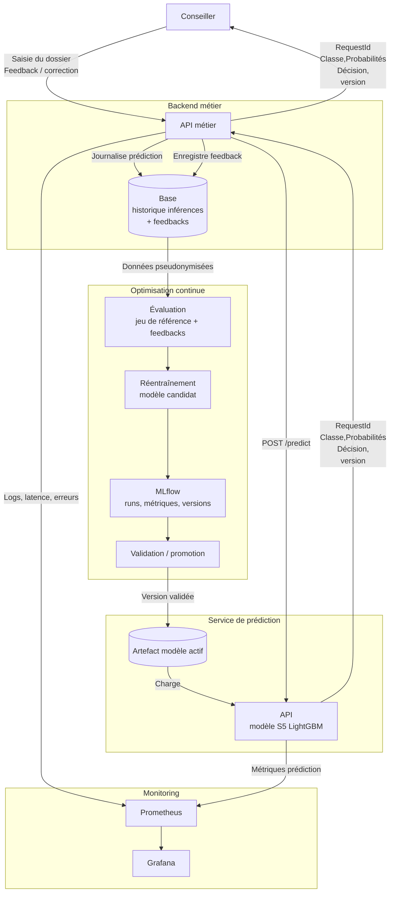

```mermaid
flowchart TD
    C[Conseiller]

    subgraph BACK["Backend métier"]
        direction TD
        B[API métier]
        DB[(Base</br>historique inférences<br/> + feedbacks)]
        B -->|Journalise prédiction| DB
        %%B -->|Consulte historique| DB
        B -->|Enregistre feedback| DB
    end

    subgraph SERVICE["Service de prédiction"]
        direction TD
        M["API<br/>modèle S5 LightGBM"]
        A[(Artefact modèle actif)]
        A -->|Charge| M
    end

    subgraph MON["Monitoring"]
        direction TB
        PR[Prometheus]
        G[Grafana]
        PR --> G
    end

    subgraph OPT["Optimisation continue"]
        direction TB
        E["Évaluation<br/>jeu de référence + feedbacks"]
        R["Réentraînement<br/>modèle candidat"]
        P[Validation / promotion]
        ML["MLflow<br/>runs, métriques, versions"]
        E --> R
        R --> ML
        ML --> P
    end

    C -->|Saisie du dossier </br> Feedback / correction| B
    B -->|RequestId<br/>Classe,Probabilités<br/>Décision,<br/>version| C

    B -->|POST /predict| M
    M -->|RequestId<br/>Classe,Probabilités<br/>Décision,<br/>version| B

    %%C -->|Feedback / correction| B
    %%B -->|Enregistre feedback| DB

    B -->|Logs, latence, erreurs| PR
    M -->|Métriques prédiction| PR

    DB -->|Données pseudonymisées| E
    P -->|Version validée| A
```